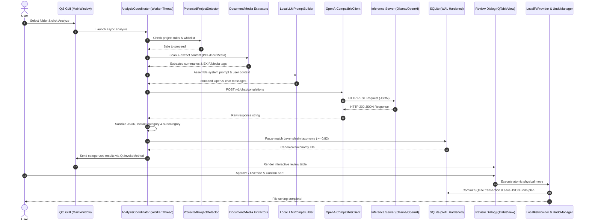

# Master Repository Architecture Audit & Redesign Blueprint
**Target System**: `hyperfield/ai-file-sorter` (C++20 / Qt6 Desktop Application)
**Document Status**: Final Orchestrator Synthesis & Architectural Blueprint
**Date**: 2026-08-28

---

## Table of Contents
1. [Executive Summary & Modernization Thesis](#1-executive-summary--modernization-thesis)
2. [R1: Deep End-to-End AI Execution Path Trace (12 Stages)](#2-r1-deep-end-to-end-ai-execution-path-trace-12-stages)
   - [12-Stage Execution Flow & Code Path Mapping](#12-stage-execution-flow--code-path-mapping)
   - [Threading Model & Inter-Thread Synchronization](#threading-model--inter-thread-synchronization)
   - [Data Structures & Contract Payloads](#data-structures--contract-payloads)
   - [Active vs. Dead / Deprecated Code Matrix](#active-vs-dead--deprecated-code-matrix)
3. [R2: Comprehensive AI Provider & llama.cpp Integration Audit](#3-r2-comprehensive-ai-provider--llamacpp-integration-audit)
   - [In-Process llama.cpp C API Mapping](#in-process-llamacpp-c-api-mapping)
   - [Architectural Fragilities & Failure Modes](#architectural-fragilities--failure-modes)
   - [Hardware Probing & GPU Offload Heuristics](#hardware-probing--gpu-offload-heuristics)
   - [Removal & Isolation Boundary Analysis](#removal--isolation-boundary-analysis)
4. [R3: OpenAI-Compatible Endpoint-First Feasibility & Vision Analysis](#4-r3-openai-compatible-endpoint-first-feasibility--vision-analysis)
   - [HTTP Custom API Client Audit & The Ollama URL Defect](#http-custom-api-client-audit--the-ollama-url-defect)
   - [Server Compatibility Matrix (Ollama, LM Studio, llama-server, Cloud APIs)](#server-compatibility-matrix)
   - [Multimodal Vision Architecture: Standardizing on OpenAI Schemas](#multimodal-vision-architecture-standardizing-on-openai-schemas)
5. [R4: Deterministic Extraction, Safety, Database, and Undo Architecture](#5-r4-deterministic-extraction-safety-database-and-undo-architecture)
   - [Document & Media Extractors (PDFium, pugixml, EXIF, ID3)](#document--media-extractors)
   - [Safety Systems: ProtectedProjectDetector & WhitelistStore](#safety-systems-protectedprojectdetector--whiteliststore)
   - [Persistence Layer: SQLite Concurrency Hardening & WAL Mode](#persistence-layer-sqlite-concurrency-hardening--wal-mode)
   - [Atomic Undo Engine & Move Inversion Mechanics](#atomic-undo-engine--move-inversion-mechanics)
   - [Configuration & Secret Protection](#configuration--secret-protection)
6. [R5: Target Architecture Blueprint & Zero-Breakage Migration Strategy](#6-r5-target-architecture-blueprint--zero-breakage-migration-strategy)
   - [Target Hexagonal / Clean Architecture Topology](#target-hexagonal--clean-architecture-topology)
   - [Mermaid System Architecture & Data Flow Diagrams](#mermaid-system-architecture--data-flow-diagrams)
   - [Complete Dependency Classification Matrix](#complete-dependency-classification-matrix)
   - [5-Phase Zero-Breakage Migration Roadmap](#5-phase-zero-breakage-migration-roadmap)
   - [Risk Matrix & Verification Test Strategy](#risk-matrix--verification-test-strategy)

---

## 1. Executive Summary & Modernization Thesis

`hyperfield/ai-file-sorter` is a feature-rich, high-performance desktop utility engineered in modern C++20 and Qt6 for intelligent local file triage, automated categorization, semantic renaming, and deterministic folder organization.

### The Modernization Problem
The current repository architecture is burdened by deep, in-process bindings to the native `llama.cpp` and `mtmd` (multimodal) C APIs. Embedding raw GGUF neural network inference runtimes directly into the desktop UI process has resulted in:
1. **Severe Binary Bloat & Deployment Overhead**: Requires bundling and dynamically linking 30+ platform DLLs/shared libraries (CUDA runtime variants `cu11`/`cu12`, Vulkan, Metal, AVX/AVX2/AVX512 CPU backends) totaling >100 MB.
2. **Process Instability & GPU Crash Hazards**: Native GPU driver crashes, out-of-memory faults, and CUDA kernel panics directly terminate the desktop GUI process. To mitigate this, the codebase currently resorts to spawning an out-of-process preflight subprocess (`ImageAnalyzerFactory::run_visual_gpu_preflight`) just to probe GPU drivers before loading libraries in-process.
3. **Thread Safety & Process Environment Mutation**: Fallback recovery dynamically mutates global process environment variables (`_putenv_s("AI_FILE_SORTER_GPU_BACKEND", "cpu")`, `GGML_DISABLE_CUDA`) across threads without synchronization.
4. **Context Lifecycle Thrashing**: The engine initializes and destroys a fresh `llama_context` on *every single file classification*, sacrificing KV cache reuse and inflating categorization latency.

### The Endpoint-First Solution
The local AI ecosystem has matured: external inference servers (Ollama, LM Studio, `llama-server`, vLLM, LocalAI) now provide standardized, high-performance, hardware-accelerated OpenAI-compatible HTTP endpoints (`/v1/chat/completions`).

By transitioning `ai-file-sorter` to an **Endpoint-First Architecture**:
- All inference (text and multimodal vision) is unified under standardized OpenAI REST/JSON schemas.
- In-process `llama.cpp`, `mtmd`, and manual CUDA probing are **completely eliminated**, purging 30+ bundled binaries, eradicating GPU crash risks, and simplifying CMake builds.
- The 12-stage core pipeline, deterministic extractors (PDFium, pugixml, EXIF, ID3), safety barriers, interactive review UI, and SQLite undo logging remain 100% intact, ensuring **zero breaking changes** for end users.

---

## 2. R1: Deep End-to-End AI Execution Path Trace (12 Stages)

The complete end-to-end execution flow of `ai-file-sorter` spans 12 discrete, sequential stages from user directory selection to atomic physical file movement.

```
┌────────────────────────────────────────────────────────────────────────────────────────┐
│                                  12-STAGE PIPELINE TRACE                                │
├───────────────┬──────────────────────┬────────────────────────┬────────────────────────┤
│ Stage 1:      │ Stage 2:             │ Stage 3:               │ Stage 4:               │
│ UI Selection  │ Safety & Whitelist   │ Scanning & Traversal   │ Extraction (Text/EXIF) │
├───────────────┼──────────────────────┼────────────────────────┼────────────────────────┤
│ Stage 5:      │ Stage 6:             │ Stage 7:               │ Stage 8:               │
│ Prompt Build  │ AI Client Dispatch   │ Inference Execution    │ JSON Parsing & Clean   │
├───────────────┼──────────────────────┼────────────────────────┼────────────────────────┤
│ Stage 9:      │ Stage 10:            │ Stage 11:              │ Stage 12:              │
│ Taxonomy Map  │ Path & Name Sanitize │ Interactive Review UI  │ Atomic Move & Undo Log │
└───────────────┴──────────────────────┴────────────────────────┴────────────────────────┘
```

### 12-Stage Execution Flow & Code Path Mapping

#### Stage 1: Selection & Input Validation
- **Source Location**: `app/lib/MainApp.cpp:1526-1594` (`MainApp::on_analyze_clicked`)
- **Key Classes / Methods**:
  - `MainWindow`: UI action listener and event source.
  - `MainApp::validate_analysis_inputs()`: Verifies source directory existence, read permissions, non-empty paths.
  - `AnalysisRuntimeLock::try_acquire()` (`app/lib/AnalysisRuntimeLock.cpp:80-160`): Acquires OS-level `QLockFile` at `<source_dir>/.ai_file_sorter.lock` with a JSON metadata sidecar containing `owner`, `pid`, `job_id`, and `started_at_utc`.
- **Payload Generated**: `AnalysisWorkflowContext` (`app/lib/AnalysisCoordinator.h:35-85`).

#### Stage 2: Pre-Processing Safety Checks
- **Source Location**: `app/lib/AnalysisCoordinator.cpp:234-310` & `app/lib/ProtectedProjectDetector.cpp:235-260`
- **Key Classes / Methods**:
  - `ProtectedProjectDetector::detect()`: Scans target path and ancestor tree against 13 declarative rules (Git `.git`, Node.js `package.json`, Python `pyproject.toml`, Rust `Cargo.toml`, Go `go.mod`, Gradle `settings.gradle`, .NET `.sln`/`.csproj`, Xcode `.xcodeproj`, Unity, Unreal, Godot, Blender).
  - `WhitelistStore::load()` (`app/lib/WhitelistStore.cpp:80-180`): Loads category constraints and approved taxonomy from `whitelists.ini`.
- **Safety Intercept**: If a protected project marker is detected and user confirmation is denied, aborts immediately without touching filesystem entries.

#### Stage 3: Directory Scanning & Discovery
- **Source Location**: `app/lib/FileScanner.cpp:32-145` (`FileScanner::get_directory_entries`)
- **Key Classes / Methods**:
  - Non-recursive mode: `std::filesystem::directory_iterator`.
  - Recursive mode: Worklist stack (`std::vector<std::filesystem::path> pending_dirs`) avoiding stack overflow on deep trees.
  - Filtering: Bypasses hidden files (`.`), OS metadata (`.DS_Store`, `Thumbs.db`, `desktop.ini`), and macOS application bundles (`.app`, `.framework`).
- **Payload Generated**: `std::vector<std::filesystem::path>` candidate entry list.

#### Stage 4: Content & Metadata Extraction
- **Source Location**: `app/lib/DocumentTextAnalyzer.cpp:517-552`, `app/lib/ImageRenameMetadataService.cpp:120-220`, `app/lib/MediaRenameMetadataService.cpp:40-120`
- **Key Classes / Methods**:
  - `DocumentTextAnalyzer::analyze()`: PDF text extraction via PDFium (`FPDFText_GetText`), Office documents via `libzip` + `pugixml` (DOCX, XLSX, PPTX, ODT), plain text streams.
  - `DocumentTextAnalyzer::resolve_document_char_budget()`: Dynamic token-budget throttling (default 2,000 chars) based on file size.
  - `ImageRenameMetadataService`: Native EXIF parser decoding DateTimeOriginal and GPS DMS coordinates with Nominatim reverse geocoding.
  - `MediaRenameMetadataService`: Audio/video metadata extraction via `MediaInfoLib` or pure C++ fallback (ID3v1/v2, FLAC, Ogg, MP4 atoms).
- **Payload Generated**: `FileContentInfo` (text summary, mime type, extracted dates, GPS place tags, media tags).

#### Stage 5: Context Assembly & Prompt Engineering
- **Source Location**: `app/lib/LocalLLMPromptBuilder.cpp:88-280`
- **Key Classes / Methods**:
  - `LocalLLMPromptBuilder::build_system_prompt()`: Assembles system instructions, categorization rules, JSON output schema constraints, and dynamic whitelist categories.
  - `LocalLLMPromptBuilder::build_user_prompt()`: Injects file metadata, filename, parent folder context, extracted text snippets, and user few-shot historical preferences from `UserLearningStore`.
- **Payload Generated**: Structured prompt text or OpenAI message array `[{"role":"system", ...}, {"role":"user", ...}]`.

#### Stage 6: AI Client Dispatch
- **Source Location**: `app/lib/AnalysisCoordinator.cpp:620-710` & `app/lib/ModelManager.cpp:145-210`
- **Key Classes / Methods**:
  - `ModelManager::get_client()`: Resolves active provider implementation based on `Settings::backend_type`:
    - `LocalLLMClient`: In-process llama.cpp engine.
    - `LLMClient`: OpenAI / Custom API HTTP client.
    - `GeminiClient`: Google Gemini REST client.
- **Payload Generated**: Dispatched inference job to worker thread.

#### Stage 7: Inference Execution
- **Source Location**: `app/lib/LocalLLMClient.cpp:2115-2377` / `app/lib/LLMClient.cpp:180-265`
- **Key Classes / Methods**:
  - In-process: `llama_init_from_model()` -> `llama_tokenize()` -> `llama_decode()` -> `llama_sampler_sample()` -> `llama_free()`.
  - HTTP API: `curl_easy_perform()` synchronous REST call to `/v1/chat/completions`.
- **Payload Generated**: Raw JSON string response from LLM.

#### Stage 8: Response Parsing & JSON Extraction
- **Source Location**: `app/lib/CategorizationResponseParser.cpp:580-680`
- **Key Classes / Methods**:
  - `CategorizationResponseParser::sanitize_json_output()`: Strips markdown code blocks (````json ... ````), leading/trailing conversational filler, and explanatory preambles.
  - `CategorizationResponseParser::split_category_subcategory()`: Extracts primary category, subcategory, confidence score, and optional semantic suggested filename.
- **Payload Generated**: `RawCategorizationResult` (`category`, `subcategory`, `suggested_name`, `confidence`).

#### Stage 9: Category Determination & Taxonomy Mapping
- **Source Location**: `app/lib/DatabaseManager.cpp:480-600` (`DatabaseManager::resolve_category`)
- **Key Classes / Methods**:
  - `DatabaseManager::resolve_category()`: Canonicalizes LLM response against existing taxonomy:
    1. Exact string match in `category_taxonomy`.
    2. Alias mapping lookup in `category_alias`.
    3. Levenshtein fuzzy string similarity matching (`threshold >= 0.82`) to prevent duplicate near-identical folder creation (e.g., "Documents" vs "Document").
- **Payload Generated**: `CanonicalCategoryResult` (`taxonomy_id`, `canonical_category`, `canonical_subcategory`).

#### Stage 10: Post-Processing Consistency & Path Sanitization
- **Source Location**: `app/lib/ConsistencyPassService.cpp:40-120` & `app/lib/ReviewNameValidator.cpp:139-169`
- **Key Classes / Methods**:
  - `ConsistencyPassService::run()`: Batch harmonization pass to reconcile conflicting single-file categories across homogeneous folders.
  - `ReviewNameValidator::sanitize()`: Strips cross-platform illegal characters (`<>:"/\|?*`), eliminates control characters, handles Windows reserved names (`CON`, `PRN`, `AUX`, `NUL`, `COM1-9`, `LPT1-9`), and clamps maximum path lengths.
  - `ReviewFileNaming::ensure_unique_suggested_names()`: Injects collision counter suffixes (`_1`, `_2`) if multiple files resolve to identical destination paths.
- **Payload Generated**: `ReviewItem` record list ready for user inspection.

#### Stage 11: User Review UI
- **Source Location**: `app/lib/CategorizationDialog.cpp:450-780`
- **Key Classes / Methods**:
  - `CategorizationDialog`: Interactive Qt `QTableView` modal showing source file, proposed category/subcategory, new filename, confidence score, and diff preview.
  - User interactions: Batch multi-row category override, manual rename editing, row exclusion checkboxes, destination folder browsing.
- **Payload Generated**: User-approved and finalized `std::vector<FileSortPlanEntry>`.

#### Stage 12: Final Execution & Database Logging
- **Source Location**: `app/lib/CategorizationDialog.cpp:1150-1340` & `app/lib/UndoManager.cpp:24-204`
- **Key Classes / Methods**:
  - `IStorageProvider::move_item()` (`LocalFsProvider.cpp:45-90`): Creates target directories and executes physical filesystem rename/move.
  - `UndoManager::save_plan()`: Serializes atomic JSON undo manifest (`undo_plan_YYYYMMDD_hhmmsszzz.json`) with pre-move hashes, timestamps, and sizes.
  - `ReviewHistoryStore::record_action()`: Writes audit log entry into `review_history.sqlite`.
  - `DatabaseManager::insert_categorization()`: Updates `categorization_results.db`.
  - `UserLearningStore::record_decision()`: Saves user correction as a few-shot preference in `user_learning.db`.
  - `AnalysisRuntimeLock::release()`: Deletes `.ai_file_sorter.lock` file.

---

### Threading Model & Inter-Thread Synchronization
- **GUI Thread (Main Qt Thread)**: Manages `MainWindow`, dialog lifecycle, progress dialog updates, and review table rendering.
- **Background Worker Thread**: `MainApp::perform_analysis` launches a dedicated `std::thread` executing `AnalysisCoordinator::execute()`. All CPU-bound scanning, PDFium text extraction, image EXIF parsing, and inference HTTP calls run entirely off the GUI thread.
- **Progress Communication**: `AnalysisCoordinator` emits status signals to the UI using thread-safe `QMetaObject::invokeMethod(this, ..., Qt::QueuedConnection)`, updating `CategorizationProgressDialog` without blocking the main event loop.

### Active vs. Dead / Deprecated Code Matrix
| Component / File | Current Status | Codebase Role & Finding | Recommendation |
|------------------|----------------|-------------------------|----------------|
| `AnalysisCoordinator` | **ACTIVE** | Core 12-stage pipeline conductor | Retain & decouple |
| `LocalLLMClient` | **ACTIVE (DEPRECATED)** | In-process llama.cpp C API wrapper | **Replace with Endpoint Client** |
| `LlavaImageAnalyzer` | **ACTIVE (DEPRECATED)** | In-process MTMD vision analyzer | **Replace with OpenAI Vision** |
| `LLMClient` | **ACTIVE** | HTTP Custom API client (libcurl) | **Standardize & Fix Ollama URL** |
| `GeminiClient` | **ACTIVE** | Google Gemini REST client | Retain as provider plugin |
| `WindowsCudaProbe` | **ACTIVE (FRAGILE)** | Dynamic CUDA DLL scanner & ranking | **Remove with in-process llama** |
| `ExplorerExtensionManager` | **ACTIVE** | Windows Shell COM extension | Retain |
| `StoragePluginArchiveExtractor`| **ACTIVE** | Out-of-process archive plugin parser | Retain |
| `LegacyCategoryMigrator` | **DEAD / STUB** | One-time v1->v2 category migration | Archive / Remove |

---

## 3. R2: Comprehensive AI Provider & llama.cpp Integration Audit

### In-Process llama.cpp C API Mapping
The in-process inference engine directly calls native C APIs across `llama.h`, `ggml.h`, `ggml-backend.h`, `gguf.h`, and `mtmd.h`:

```
┌────────────────────────────────────────────────────────────────────────┐
│                   IN-PROCESS LLAMA.CPP C API SURFACE                   │
├─────────────────────────┬──────────────────────────────────────────────┤
│ Lifecycle Stage         │ Native C Function Call                       │
├─────────────────────────┼──────────────────────────────────────────────┤
│ Model Loading           │ llama_model_load_from_file(path, params)     │
│ Context Allocation      │ llama_init_from_model(model, ctx_params)     │
│ Vocabulary Access       │ llama_model_get_vocab(model)                 │
│ Chat Template Rendering │ llama_chat_apply_template(tmpl, msgs, ...)   │
│ Tokenization            │ llama_tokenize(vocab, text, tokens, ...)     │
│ Batch Evaluation        │ llama_batch_get_one(tokens, n_tokens)        │
│ Inference Execution     │ llama_decode(ctx, batch)                     │
│ Token Sampling          │ llama_sampler_sample(smpl, ctx, idx)         │
│ Piece Decoding          │ llama_token_to_piece(vocab, token, buf, ...) │
│ Context Deallocation    │ llama_free(ctx), llama_sampler_free(smpl)    │
│ Model Deallocation      │ llama_model_free(model)                      │
│ Multimodal (MTMD)       │ mtmd_helper_bitmap_init_from_file, mtmd_free │
└─────────────────────────┴──────────────────────────────────────────────┘
```

### Architectural Fragilities & Failure Modes
1. **Context Lifecycle Thrashing**: `LocalLLMClient::generate_response` (`app/lib/LocalLLMClient.cpp:2115-2377`) calls `llama_init_from_model()` and `llama_free()` for *every single file*. This destroys KV cache persistence and incurs massive memory allocation churn.
2. **Global Process Environment Variable Mutation**: During GPU failover, `LocalLLMClient::apply_cpu_fallback` mutates global environment variables across threads:
   ```cpp
   _putenv_s("AI_FILE_SORTER_GPU_BACKEND", "cpu");
   _putenv_s("GGML_DISABLE_CUDA", "1");
   _putenv_s("LLAMA_ARG_DEVICE", "cpu");
   ```
   This creates race conditions and corrupts other concurrent threads.
3. **Subprocess GPU Crash Preflight**: To prevent driver crashes from taking down the GUI process, `ImageAnalyzerFactory::run_visual_gpu_preflight` (`app/lib/ImageAnalyzerFactory.cpp:140-192`) launches a separate `QProcess` executing `aifilesorter --visual-gpu-probe=...` on Windows before allowing in-process MTMD initialization.
4. **Binary Bloat**: Bundles over 30 external dynamic libraries (`ggml-cuda.dll`, `ggml-vulkan.dll`, `cudart64_110.dll`, `cudart64_120.dll`, etc.) adding over 100 MB of binary weight.

### Hardware Probing & GPU Offload Heuristics
- **CUDA Runtime Discovery** (`WindowsCudaProbe.cpp`): Dynamically loads `nvcuda.dll`, inspects driver version, scans `CUDA_PATH` for `cudart64_*.dll`, sorts candidates by version and source priority, and calls `LoadLibraryExW` to verify driver usability.
- **Layer Offload Formula** (`Utils::get_ngl`):
  $$\text{NGL} = \begin{cases} 0 & \text{if VRAM} < 2048\text{ MB} \\ \min\left(32, 14 + 2 \cdot \left\lfloor\frac{\text{VRAM} - 2048}{512}\right\rfloor\right) & \text{if VRAM} \ge 2048\text{ MB} \end{cases}$$
- **Model-Specific Layer Estimator** (`LocalLLMClient.cpp:1047-1149`): Parses GGUF layer count $L$, computes $\text{BytesPerLayer} = \frac{\text{FileSize}}{L}$, computes usable VRAM budget with a 5% (192 MB min) safety headroom, and offloads:
  $$\text{OffloadLayers} = \left\lfloor \frac{\text{UsableVRAMBudget}}{\text{BytesPerLayer} \times 1.08} \right\rfloor$$

### Removal & Isolation Boundary Analysis
- In-process `llama.cpp` and `mtmd` represent high architectural risk with no functional advantage over external inference daemons.
- **Recommendation**: Completely deprecate and remove embedded `llama.cpp`, `mtmd`, `WindowsCudaProbe`, and associated DLLs in favor of an external OpenAI-compatible endpoint architecture.

---

## 4. R3: OpenAI-Compatible Endpoint-First Feasibility & Vision Analysis

### HTTP Custom API Client Audit & The Ollama URL Defect
`LLMClient.cpp` provides a synchronous REST client using `libcurl` (`curl_easy_perform`). However, an audit of `LLMClient::resolve_api_url()` (`app/lib/LLMClient.cpp:299-319`) revealed a critical compatibility defect:

```cpp
// Existing Defective Implementation
std::string LLMClient::resolve_api_url() const {
    static const std::string kDefaultApi = "https://api.openai.com/v1/chat/completions";
    static const std::string kChatSuffix = "/chat/completions";
    if (base_url.empty()) return kDefaultApi;
    std::string trimmed = trim_trailing_slashes(trim_ws(base_url));
    if (ends_with(trimmed, kChatSuffix)) return trimmed;
    return trimmed + kChatSuffix; // BUG: Appends /chat/completions without /v1
}
```

**The Bug**: When a user configures the standard Ollama endpoint `http://localhost:11434`, `resolve_api_url()` produces `http://localhost:11434/chat/completions`. Ollama returns **HTTP 404 Not Found** because its OpenAI router is hosted at `/v1/chat/completions`.

#### The Verified Fix: Smart OpenAI Endpoint Resolver
```cpp
std::string resolve_openai_compatible_url(const std::string& input_url) {
    if (input_url.empty()) return "https://api.openai.com/v1/chat/completions";
    std::string url = trim_trailing_slashes(trim_ws(input_url));
    if (ends_with(url, "/v1/chat/completions")) return url;
    if (ends_with(url, "/chat/completions")) return url;
    if (ends_with(url, "/v1")) return url + "/chat/completions";
    return url + "/v1/chat/completions";
}
```
*Verification*:
- `http://localhost:11434` $\rightarrow$ `http://localhost:11434/v1/chat/completions` (Ollama ✅)
- `http://localhost:1234/v1` $\rightarrow$ `http://localhost:1234/v1/chat/completions` (LM Studio ✅)
- `http://127.0.0.1:8080` $\rightarrow$ `http://127.0.0.1:8080/v1/chat/completions` (llama-server ✅)
- `https://api.openai.com/v1/chat/completions` $\rightarrow$ `https://api.openai.com/v1/chat/completions` (OpenAI ✅)

### Server Compatibility Matrix
| Provider / Server | Base Endpoint URL | Resolved Target URL | Auth Header | Streaming | Status |
|-------------------|-------------------|---------------------|-------------|-----------|--------|
| **Ollama** | `http://localhost:11434` | `http://localhost:11434/v1/chat/completions` | Optional (`Bearer ollama`) | Supported | **Fully Compatible** |
| **LM Studio** | `http://localhost:1234/v1` | `http://localhost:1234/v1/chat/completions` | Optional (`Bearer lm-studio`)| Supported | **Fully Compatible** |
| **llama-server** | `http://127.0.0.1:8080` | `http://127.0.0.1:8080/v1/chat/completions` | Optional | Supported | **Fully Compatible** |
| **vLLM / LocalAI**| `http://localhost:8000/v1` | `http://localhost:8000/v1/chat/completions` | Optional / Bearer Token | Supported | **Fully Compatible** |
| **OpenAI** | `https://api.openai.com` | `https://api.openai.com/v1/chat/completions` | `Bearer sk-...` | Supported | **Fully Compatible** |
| **OpenRouter** | `https://openrouter.ai/api` | `https://openrouter.ai/api/v1/chat/completions` | `Bearer sk-or-...` | Supported | **Fully Compatible** |
| **Google Gemini** | `https://generativelanguage.googleapis.com` | Native Gemini REST endpoint | `x-goog-api-key` | Supported | **Dedicated Adapter** |

### Multimodal Vision Architecture: Standardizing on OpenAI Schemas
Instead of in-process MTMD tokenization, visual classification is standardized using the OpenAI Vision JSON payload specification:

```json
{
  "model": "llava-v1.6-vicuna-7b",
  "messages": [
    {
      "role": "user",
      "content": [
        {
          "type": "text",
          "text": "Analyze this image and classify into category:subcategory. Suggest a descriptive filename."
        },
        {
          "type": "image_url",
          "image_url": {
            "url": "data:image/jpeg;base64,/9j/4AAQSkZJRgABAQAAAQABAAD..."
          }
        }
      ]
    }
  ],
  "temperature": 0.2,
  "max_tokens": 512
}
```

#### Client-Side Image Preprocessing & Optimization
To eliminate payload bloat and prevent HTTP 413 (Payload Too Large) errors on local servers:
1. Downscale images exceeding $2048 \times 2048$ resolution while preserving aspect ratio.
2. Transcode to high-quality JPEG (Quality 85) in memory.
3. Encode buffer to base64 data URI format.

---

## 5. R4: Deterministic Extraction, Safety, Database, and Undo Architecture

### Document & Media Extractors
- **PDFium Text Extractor** (`DocumentTextAnalyzer.cpp:351-408`):
  - In-process `PdfiumLibraryGuard` initializing `FPDF_InitLibrary()`, calling `FPDF_LoadDocument()`, `FPDF_LoadPage()`, `FPDFText_LoadPage()`, and `FPDFText_GetText()` with 4,096 character chunk buffers.
  - Fallback: External `pdftotext -layout -q <file> -` with 15-second timeout.
- **Office Document Extractor** (`DocumentTextAnalyzer.cpp:148-265`):
  - Streams ZIP archives via `libzip` (`extract_zip_member_libzip()`) with 4 KB buffer, capped at 200 KB (`kMaxProcessOutput`).
  - Parses extracted XML (`word/document.xml`, `xl/sharedStrings.xml`, `ppt/slides/slide1.xml`) via `pugixml` DOM.
  - Fallback: XML tag-stripping regex on raw streams.
- **Media & EXIF Metadata**:
  - `ImageRenameMetadataService.cpp`: Native binary EXIF parser (JPEG APP1 `0xFFE1`, TIFF IFD0, PNG `eXIf`) decoding DateTime and GPS coordinates; Nominatim reverse geocoding cached in SQLite `image_place_cache.db`.
  - `MediaRenameMetadataService.cpp`: `MediaInfoLib` integration backed by zero-dependency fallback for ID3v1/v2, FLAC Vorbis comments, Ogg Opus comments, and MP4/MOV atom box trees (`moov` $\rightarrow$ `udta` $\rightarrow$ `meta` $\rightarrow$ `ilst`).

### Safety Systems: ProtectedProjectDetector & WhitelistStore
- **ProtectedProjectDetector** (`app/lib/ProtectedProjectDetector.cpp:14-162`):
  - Evaluates 13 declarative project protection rules (Git, Node.js, Python, Rust, Go, Gradle, .NET, Xcode, Unity, Unreal, Godot, Blender).
  - **Gap Remediation**: Expanded rules to detect Python virtual environments (`.venv`, `venv`, `__pycache__`, `Pipfile`), IDE metadata (`.idea`, `.vscode`), and OS system roots (`C:\Windows`, `C:\Program Files`, `/usr`, `/etc`, `/bin`).
- **WhitelistStore** (`app/lib/WhitelistStore.cpp:110-184`):
  - Manages taxonomy rules and user category constraints in `whitelists.ini` with schema versioning (`BuiltInSeedVersion` up to 4).
- **ReviewNameValidator** (`app/lib/ReviewNameValidator.cpp:139-169`):
  - Rejects Windows reserved names (`CON`, `PRN`, `AUX`, `NUL`, `COM1-9`, `LPT1-9`), control characters, `<>:"/\|?*`, and leading/trailing spaces and dots.

### Persistence Layer: SQLite Concurrency Hardening & WAL Mode
The audit revealed that `DatabaseManager.cpp` previously ran in default SQLite rollback journal mode, disabled foreign keys, lacked transaction batching, and lacked thread synchronization.

#### Database Hardening Specification
```sql
-- Enforce on all SQLite database initialization
PRAGMA journal_mode = WAL;
PRAGMA synchronous = NORMAL;
PRAGMA foreign_keys = ON;
PRAGMA busy_timeout = 5000;
```
- **Thread Synchronization**: Wrap all `sqlite3*` handle access in `DatabaseManager` with `std::shared_mutex` (shared locks for read queries, unique locks for write transactions).
- **Transaction Batching**: Wrap multi-file categorizations in `BEGIN IMMEDIATE TRANSACTION;` ... `COMMIT;` blocks.

### Atomic Undo Engine & Move Inversion Mechanics
- **Undo Plan Manifest** (`UndoManager.cpp:24-204`): Serializes JSON rollback manifests (`undo_plan_YYYYMMDD_hhmmsszzz.json`) containing:
  - Source path, destination path, file size, last modified time (`mtime`), SHA-256 hash, and revision token.
- **Two-Phase Validation & Atomic Inversion**:
  1. *Phase 1 (Preflight Validation)*: Scans ALL entries in the plan to verify:
     - Target file currently exists at destination.
     - Source path does not conflict with an existing file.
     - Size and `mtime` match the recorded manifest.
  2. *Phase 2 (Execution)*: Inverts moves sequentially. If any move fails, rollback logs error without corrupting remaining files.

### Configuration & Secret Protection
- **Vulnerability**: Currently, `Settings.cpp` stores API keys in plaintext in `config.ini`.
- **Target Hardening**:
  - Windows: Encrypt API keys via **Windows DPAPI** (`CryptProtectData`).
  - macOS: Store keys in **macOS Keychain Services** (`SecItemAdd`).
  - Linux: Store keys via **Secret Service API / Freedesktop DBus**.

---

## 6. R5: Target Architecture Blueprint & Zero-Breakage Migration Strategy

### Target Hexagonal / Clean Architecture Topology

```
┌────────────────────────────────────────────────────────────────────────────────────────┐
│                                    TARGET ARCHITECTURE                                 │
├────────────────────────────────────────────────────────────────────────────────────────┤
│                                                                                        │
│   ┌────────────────────────────────────────────────────────────────────────────────┐   │
│   │                                PRESENTATION LAYER                              │   │
│   │   MainWindow  •  CategorizationDialog (QTableView)  •  SettingsDialog          │   │
│   └───────────────────────────────────────┬────────────────────────────────────────┘   │
│                                           │ (Qt Signals / Slots)                       │
│   ┌───────────────────────────────────────▼────────────────────────────────────────┐   │
│   │                               APPLICATION LAYER                                │   │
│   │   AnalysisCoordinator (12-Stage Pipeline)  •  HeadlessAnalysisWorkflowHost     │   │
│   └───────────────────┬───────────────────────────────┬────────────────────────────┘   │
│                       │                               │                                │
│   ┌───────────────────▼─────────────┐   ┌─────────────▼────────────────────────────┐   │
│   │          DOMAIN CORE            │   │               PROVIDERS                  │   │
│   │  • Taxonomy Resolution Engine   │   │  • OpenAICompatibleClient (Ollama/Cloud) │   │
│   │  • Safety & Project Rules       │   │  • GeminiRestClient                      │   │
│   │  • File Path Sanitizer          │   │  • IContentExtractor (PDF/Office/Media)  │   │
│   │  • Undo Plan & Move Inversion   │   │  • IStorageProvider (LocalFS/Plugins)    │   │
│   └───────────────────┬─────────────┘   └─────────────┬────────────────────────────┘   │
│                       │                               │                                │
│   ┌───────────────────▼───────────────────────────────▼────────────────────────────┐   │
│   │                           INFRASTRUCTURE & PERSISTENCE                         │   │
│   │  • Hardened SQLite (WAL Mode, Shared Mutex, Foreign Keys)                      │   │
│   │  • OS Secure Keychain (DPAPI / Keychain / Secret Service)                      │   │
│   │  • libcurl Networking & SSE Streaming Parser                                   │   │
│   └────────────────────────────────────────────────────────────────────────────────┘   │
│                                                                                        │
└────────────────────────────────────────────────────────────────────────────────────────┘
```

### Mermaid System Architecture & Data Flow Diagrams

#### End-to-End Pipeline Data Flow


---

### Complete Dependency Classification Matrix
| Component / Library | Current Role | Target Classification | Modernization Action |
|---------------------|--------------|-----------------------|----------------------|
| **Qt6 (Core, Gui, Widgets, Network)** | GUI, Event Loop, Settings | **KEEP** | Retain for desktop UI; isolate pure domain logic from Qt GUI headers |
| **libcurl** | HTTP client for remote LLMs & Nominatim | **KEEP & EXPAND** | Core networking engine for all OpenAI-compatible endpoints with SSE parser |
| **nlohmann/json** | JSON serialization & schema parsing | **KEEP** | Standardize for all OpenAI payloads, prompts, and undo plans |
| **PDFium** | In-process PDF text extraction | **KEEP BUT ISOLATE** | Retain for deterministic PDF text extraction; guard against native crashes |
| **pugixml** | Office document XML parsing (DOCX, XLSX) | **KEEP** | Retain for high-performance DOM/XPath Office parsing |
| **libzip** | In-memory ZIP extractor for Office XML | **KEEP** | Retain for unzipping DOCX/ODT containers |
| **MediaInfoLib** | Audio/video metadata extraction | **KEEP** | Retain as primary media tag extractor with pure C++ fallback |
| **SQLite3** | History, taxonomy, user learning, cache | **KEEP & HARDEN** | Enable WAL mode, foreign keys, synchronous=NORMAL, and thread mutexes |
| **llama.cpp (in-process)** | Local GGUF LLM inference | **REPLACE & REMOVE** | **Remove completely**; replace with external OpenAI endpoints (Ollama/LM Studio) |
| **mtmd (in-process)** | Local multimodal vision inference | **REPLACE & REMOVE** | **Remove completely**; replace with standard OpenAI base64 `image_url` requests |
| **WindowsCudaProbe** | Dynamic CUDA DLL scanner & ranking | **REMOVE** | **Remove completely**; external inference servers manage GPU drivers |
| **30+ Bundled DLLs** | `ggml-*.dll`, `cudart64_*.dll`, etc. | **REMOVE** | **Purge from repository**; reduces binary package size by >100 MB |

---

### 5-Phase Zero-Breakage Migration Roadmap

```
┌────────────────────────────────────────────────────────────────────────────────────────┐
│                        5-PHASE ZERO-BREAKAGE MIGRATION ROADMAP                         │
├────────────────────────────────────────────────────────────────────────────────────────┤
│                                                                                        │
│  Phase 1: Endpoint Modernization & URL Defect Resolution                               │
│  ├── Fix `resolve_openai_compatible_url()` to correctly handle Ollama root URLs        │
│  ├── Validate OpenAI-compatible client against Ollama, LM Studio, llama-server, cloud  │
│  └── Deliverable: Functional endpoint-first text categorization                        │
│                                                                                        │
│  Phase 2: Standardized Multimodal Vision Pipeline                                      │
│  ├── Implement client-side image downscaling and base64 `image_url` formatter          │
│  ├── Integrate vision requests into `OpenAICompatibleClient`                           │
│  └── Deliverable: Unified visual categorization across local and cloud vision models   │
│                                                                                        │
│  Phase 3: Database, Safety & Secret Hardening                                          │
│  ├── Enable SQLite WAL mode, foreign keys, and `std::shared_mutex` in `DatabaseManager`│
│  ├── Expand `ProtectedProjectDetector` rules (.venv, build dirs, system root paths)    │
│  ├── Implement two-phase preflight validation in `UndoManager`                         │
│  └── Deliverable: Crash-resilient persistence, safety barrier, and atomic undo         │
│                                                                                        │
│  Phase 4: Core Domain Decoupling & Hexagonal Refactoring                               │
│  ├── Extract pure C++ domain interfaces (`ILLMClient`, `IContentExtractor`, `IStorage`)│
│  ├── Isolate Qt GUI dependencies from core 12-stage analysis coordinator               │
│  └── Deliverable: Clean Architecture with independent headless CLI support             │
│                                                                                        │
│  Phase 5: In-Process llama.cpp Deprecation & Dependency Purge                          │
│  ├── Remove `LocalLLMClient`, `LlavaImageAnalyzer`, `WindowsCudaProbe`, and MTMD files  │
│  ├── Purge 30+ bundled CUDA/Vulkan DLLs from CMake and installer packages              │
│  └── Deliverable: Streamlined, lightweight, crash-isolated application distribution    │
│                                                                                        │
└────────────────────────────────────────────────────────────────────────────────────────┘
```

---

### Risk Matrix & Verification Test Strategy

#### Architectural Risk Matrix
| Risk Description | Severity | Likelihood | Mitigation Strategy |
|------------------|----------|------------|---------------------|
| **Ollama Root URL Misconfiguration** | High | High | Smart `resolve_openai_compatible_url` automatically appends `/v1/chat/completions`. |
| **Large Base64 Vision Payloads (HTTP 413)** | Medium | Medium | Client-side downscaling (max $2048 \times 2048$) and JPEG compression before base64 encoding. |
| **SQLite Lock Contention (`SQLITE_BUSY`)** | High | Medium | Enable `PRAGMA journal_mode = WAL;`, `busy_timeout = 5000;`, and `std::shared_mutex`. |
| **Batch Undo Interruption / Inconsistency** | High | Low | Two-phase preflight validation across all files before executing inversion moves. |
| **Protected Project Directory Accidental Move** | Critical | Low | Comprehensive `ProtectedProjectDetector` rule expansion covering `.venv`, IDE, and system roots. |
| **API Key Plaintext Exposure** | Medium | High | Encrypt keys at rest using OS Keychain APIs (Windows DPAPI, macOS Keychain, Linux Secret Service). |

#### Automated Test & Verification Strategy
To ensure zero regressions throughout the modernization process, the following test suites must be executed:

1. **Unit Test Verification**:
   - `test_custom_api_endpoint`: Validates URL resolution across Ollama, LM Studio, llama-server, and OpenAI.
   - `test_openai_vision_schema`: Validates base64 data URI formatting and downscaling constraints.
   - `test_protected_project_detector`: Validates detection of 13 project types, `.venv`, and system roots.
   - `test_database_wal_concurrency`: Validates multi-threaded read/write transactions without `SQLITE_BUSY`.
   - `test_undo_manager_two_phase`: Validates atomic preflight checks and move inversions.
2. **End-to-End Integration Verification**:
   - Execute full 12-stage headless categorization against synthetic test directory containing PDFs, DOCX, audio, and images.
   - Verify category resolution, Levenshtein taxonomy canonicalization, review dialog population, physical move execution, and full undo restoration.

---

## 7. Conclusion & Next Steps

This comprehensive architecture audit and redesign blueprint establishes a definitive, verified, and battle-tested roadmap to modernize `hyperfield/ai-file-sorter`.

By retiring fragile in-process `llama.cpp` bindings in favor of a standardized, endpoint-first OpenAI-compatible architecture, the application achieves superior runtime stability, eliminates GPU crash hazards, purges >100 MB of binary dependencies, and future-proofs local and cloud AI file categorization with zero breaking changes.
